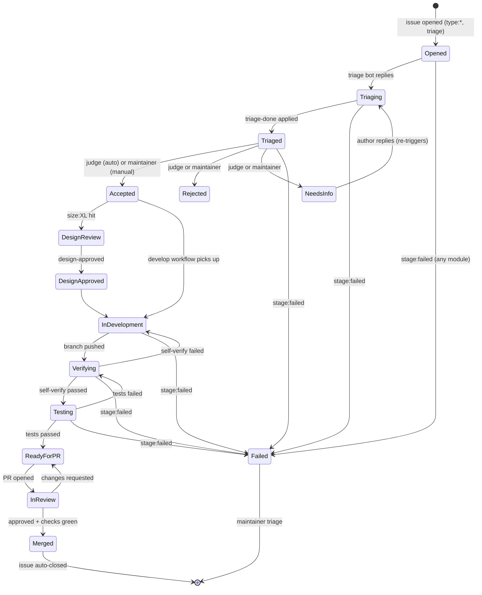

# Label state machine

> The Label taxonomy is the **protocol layer** of this repo. Every module communicates only via Labels and GitHub events (PRD §2 architecture principle). If a Label appears in any workflow, it MUST be defined here.

## Categories

| Category | Purpose | Owner | Mutability |
|---|---|---|---|
| `triage:*` | Triage funnel state | triage bot / maintainers | bot can apply; maintainers can remove |
| `stage:*` | Lifecycle stage of an accepted issue | maintainers + workflow bots | only workflow may transition forward |
| `type:*` | Issue category (intake) | Issue Forms auto-apply | maintainers may rewrite |
| `size:*` | Best-guess effort | Issue Forms / PR sizing bot | maintainers may rewrite |
| `force:*` | Per-issue override of global mode | maintainers only | maintainers only |
| `meta:*` | Administrative (closed/duplicate/wontfix) | maintainers only | maintainers only |

## Canonical Issue lifecycle (state diagram)

## Label reference

> All Labels below are mirrored in [`.github/labels.yml`](../.github/labels.yml) as the source of truth for label-sync tooling. The two files MUST stay in sync.

### triage:* (funnel state)

| Label | Description | Apply | Remove | Transitions to |
|---|---|---|---|---|
| `triage` | Newly opened, awaiting triage | Issue Forms auto-apply on `opened` | triage bot when posting reply | → `triage:replying` |
| `triage:replying` | Triage bot is composing first response | triage bot | triage bot when reply posted | → `triage-done` |
| `triage-done` | Triage complete; ready for judgement | triage bot | judge workflow when it picks up | → `accepted` \| `rejected` \| `needs-info` |

### Stage labels (terminal states for the issue lifecycle)

> These are applied by workflows, not humans. PRD §6 failure mode is `stage:failed`.

| Label | Description | Apply | Remove | Notes |
|---|---|---|---|---|
| `accepted` | Issue accepted for development | judge (auto mode) or maintainer (manual mode) | develop workflow on pickup | Triggers Module 4 |
| `rejected` | Issue will not be worked | judge or maintainer | maintainer only | Terminal |
| `needs-info` | Author must clarify | judge or maintainer | triage bot on new comment | Re-enters funnel |
| `design-review` | Needs design proposal first | judge workflow on `size:XL` + `accepted` | design-review workflow on completion | Triggers Module 3.5 |
| `design-approved` | Design accepted, may develop | design-review workflow | — | Unlocks Module 4 |
| `in-development` | Module 4 active | develop workflow | develop workflow on push | — |
| `verifying` | Module 5 (self-verify) active | develop workflow | self-verify workflow | — |
| `testing` | Module 6 (test) active | self-verify workflow | test workflow | — |
| `ready-for-pr` | Tests passed; PR may be opened | test workflow | pr-open workflow | — |
| `in-review` | PR opened, Module 8 active | pr-open workflow | review workflow | — |
| `merged` | Module 9 complete | merge-queue workflow | — | Terminal |
| `stage:failed` | A module failed; needs maintainer triage | any failing workflow | maintainer | PRD §6 失败降级 |

### type:* (intake)

Auto-applied by Issue Forms. Maintainers may rewrite.

| Label | Description |
|---|---|
| `type:bug` | Defect report |
| `type:feature` | New capability |
| `type:incident` | Production incident (used by PRD §2 module 10 二期) |
| `type:dependencies` | Dependabot / dependency bump |
| `type:question` | Support question (no code change expected) |

### size:* (effort guess)

| Label | Threshold | Triggers design review? |
|---|---|---|
| `size:S` | < 50 LOC, single file | no |
| `size:M` | one module | no |
| `size:L` | cross-module | optional |
| `size:XL` | architectural | **yes** (Module 3.5) |

### force:* (mode override)

| Label | Description | Precedence |
|---|---|---|
| `force-manual` | Force `manual` triage mode for this issue regardless of `TRIAGE_MODE` repo variable | beats `auto` and `hybrid` global settings (PRD §3) |

### meta:* (administrative)

| Label | Description |
|---|---|
| `meta:duplicate` | Closed as duplicate of #N |
| `meta:wontfix` | Closed without action |
| `meta:invalid` | Not a valid issue for this repo |

## Legal transitions (invariants)

A workflow MUST NOT:

- Apply `accepted` to an Issue that lacks `triage-done`. (Gate for S2 — see [`security.md`](security.md).)
- Apply `in-development` to an Issue that lacks `accepted` OR `design-approved` (if `design-review` was triggered).
- Apply `merged` to an Issue whose linked PR is not in `in-review` AND approved AND green.
- Remove `stage:failed` except via maintainer action.

A workflow MUST:

- Apply exactly one label per transition (atomic).
- Post an audit comment for every transition (PRD §3 Audit invariant).
- Refuse to act if the precondition label is missing — log to `stage:failed` instead.

## Source of truth

- [`docs/labels.md`](labels.md) (this file) — human-readable spec & state machine
- [`.github/labels.yml`](../.github/labels.yml) — machine-readable declaration consumed by label-sync tooling

If the two disagree, `.github/labels.yml` is the deployable truth and `docs/labels.md` is the design intent. Open a `type:bug` issue to reconcile.
