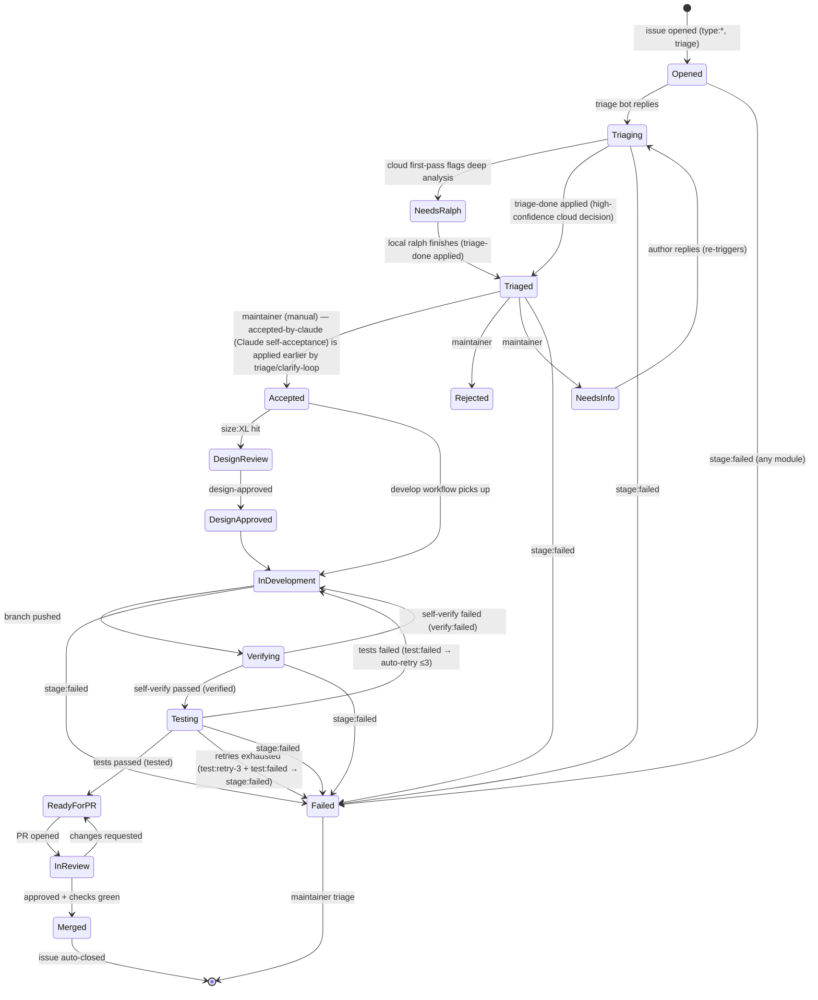

# Label state machine

> The Label taxonomy is the **protocol layer** of this repo. Every module communicates only via Labels and GitHub events (PRD §2 architecture principle). If a Label appears in any workflow, it MUST be defined here.

## Categories

| Category | Purpose | Owner | Mutability |
|---|---|---|---|
| `triage:*` | Triage funnel state | triage bot / maintainers | bot can apply; maintainers can remove |
| `stage:*` | Lifecycle stage of an accepted issue | maintainers + workflow bots | only workflow may transition forward |
| `type:*` | Issue category (intake) | Issue Forms auto-apply | maintainers may rewrite |
| `size:*` | Best-guess effort | Issue Forms / PR sizing bot | maintainers may rewrite |
| `force:*` | Per-issue override of global mode | maintainers only | maintainers only |
| `meta:*` | Administrative (closed/duplicate/wontfix) | maintainers only | maintainers only |

## Canonical Issue lifecycle (state diagram)



## Label reference

> All Labels below are mirrored in [`.github/labels.yml`](../.github/labels.yml) as the source of truth for label-sync tooling. The two files MUST stay in sync.

### triage:* (funnel state)

| Label | Description | Apply | Remove | Transitions to |
|---|---|---|---|---|
| `triage` | Newly opened, awaiting triage | Issue Forms auto-apply on `opened` | triage bot when posting reply | → `triage:replying` |
| `triage:replying` | Triage bot is composing first response | triage bot | triage bot when reply posted | → `triage-done` |
| `needs-ralph` | **v2**: emitted ONLY by clarify-loop.yml max-rounds fallback when Claude cannot reach clarity after N rounds | clarify-loop.yml (terminal exhaustion) | maintainer takeover | → `triage-done` (maintainer-driven ralph deep analysis) |
| `needs-clarify` | **v2**: cloud first-pass flagged; awaiting Module 3' clarify loop | triage-issue.yml (low-confidence `work` decisions only) | clarify-loop.yml on `accepted-by-claude` / `yielded` / max-rounds fallback | → `accepted-by-claude` \| `yielded` \| `needs-ralph` |
| `clarify-r-1` / `clarify-r-2` / `clarify-r-3` | **v2**: state marker — Claude asked a round-N question, awaiting author reply | clarify-loop.yml dispatch shell (round N) | clarify-loop.yml (next round / resolution) | → next round or resolution label |
| `accepted-by-claude` | **v2**: Claude self-acceptance after clarify loop reached clarity (S2 amendment — distinct from maintainer-only `accepted`) | clarify-loop.yml dispatch shell only | develop.yml on branch creation | → `in-development` |
| `yielded` | **v2**: Claude yielded; maintainer takeover requested | clarify-loop.yml dispatch shell | maintainer | maintainer applies next label |
| `triage-done` | Maintainer accept/reject decision pending (v1 maintainer-driven path) | local handle-triage.sh (v1, after ralph finishes) OR maintainer manual | maintainer when applying `accepted`/`rejected` | → `accepted` \| `rejected` \| `needs-info` |

### Decision vocabulary mapping (cloud ↔ Module 3')

The cloud first-pass emits `decision ∈ {reply, work}` × `confidence ∈ [0,1]`. The v2 Module 3' clarify loop emits `action ∈ {ask, accept, yield}`. Mapping:

| Cloud decision + confidence | Module 3' routing | Module 3' action | Resulting label |
|---|---|---|---|
| `work` + trivial/standard (M8) | triage direct auto-accept | n/a | `accepted-by-claude` (S2 amendment — no clarify loop) |
| `work` + complex | triage routes to clarify loop | n/a | `needs-clarify` |
| `work` + low conf | queue clarify loop (`needs-clarify`) | `ask` (round N) | `clarify-r-N` |
| `work` + low conf | (after round N) | `accept` | `accepted-by-claude` |
| `work` + low conf | (after round N) | `yield` | `yielded` |
| `work` + low conf | (rounds exhausted, max-rounds fallback) | n/a — emits `needs-ralph` | `needs-ralph` (the ONLY v2 path that emits `needs-ralph`) |
| `reply` + any conf | v1 maintainer path (no clarify loop) | n/a | maintainer manual |

### accepted-by-claude state machine (S2 amendment)

`accepted-by-claude` is the v2 S2-amendment label that lets Claude self-accept
an issue after the clarify loop reaches clarity, while preserving the
maintainer-only `accepted` invariant. Rules:

(a) **Applied by** either:
    - **triage-issue.yml** (M8 amendment) when the triage composite returns
      `decision=work` AND `workload_class ∈ {trivial, standard}` — low-risk
      self-acceptance that bypasses the clarify loop entirely.
    - **clarify-loop.yml dispatch shell** after Claude's sealed JSON returns
      `action=accept`. Re-fetched label race-check (AC-V2-8b) aborts the apply
      if `rejected`, `force-manual`, or `accepted` was added by a maintainer
      during the run.
(b) **Removed by** the develop.yml workflow on branch creation (replaced with
    `in-development`). Maintainers can force removal via `force-manual` or
    `rejected` (both halt the clarify loop in preflight).
(c) **Coexists with** `accepted`: either label triggers develop-gate.yml
    (AC-V2-12, M6 — develop.yml was removed in M7). A maintainer may apply
    `accepted` at any time to override the Claude path and force Module 4
    entry; the two labels are mutually exclusive in practice (develop-gate
    removes both on pickup).

See [`docs/security.md#s2-amendment`](security.md#s2-amendment) for the full
containment list (sealed JSON schema, dispatch shell, `--disallowedTools`,
DENY_LIST, AC-V2-8b race guard, AC-V2-13a log-scan).

### Auto-retry state machine (Module 6 → Module 4 feedback loop)

When Module 6 test fails, the pipeline automatically retries Module 4 (develop)
up to `TEST_RETRY_MAX` times (default 3), injecting the prior test report into
the Module 4 prompt so Claude can fix the identified issues.

**Flow:**

```
Module 6 test:failed
  ↓
test.yml reads retry count from test:retry-N labels
  ↓
if count < TEST_RETRY_MAX (default 3):
  - removes test:failed, verified (if present)
  - adds test:retry-(N+1)
  - adds accepted → triggers Module 4 (develop)
  - posts audit comment with retry count, failure summary, run URL
  ↓
Module 4 develop re-runs:
  - develop.yml detects test:retry-N label
  - reads most recent Module 6 test report from issue comments
  - passes as prior-test-report input to composite action
  - Claude sees "Prior test feedback" section in prompt
  ↓
... pipeline continues (verify → test) ...
  ↓
if count >= TEST_RETRY_MAX:
  - adds stage:failed
  - posts "retries exhausted" comment
  - stops (maintainer triage required)
```

**Labels:**

| Label | Meaning | Apply | Remove |
|---|---|---|---|
| `test:retry-1` | First auto-retry in progress | test.yml (on fail) | develop.yml on completion (replaced with `in-development`) |
| `test:retry-2` | Second auto-retry in progress | test.yml (on fail) | develop.yml on completion |
| `test:retry-3` | Third auto-retry in progress; next fail escalates | test.yml (on fail) | develop.yml on completion; next fail → `stage:failed` |

**Configuration:**

- `TEST_RETRY_MAX` repo var (default 3): maximum retry attempts before escalation
- Retry labels `test:retry-1/2/3` persist across pipeline cycles as the counter
- `prior-test-report` input on develop composite action is empty for first attempts

**Idempotency:**

- Retry labels are never removed until Module 4 completes and applies `in-development`
- On each subsequent Module 6 failure, the next `test:retry-N` label is added
- The counter is monotonic — it never decreases within a single issue lifecycle
- `concurrency` group on test.yml prevents race conditions within a single issue

**Security (S2):**

- `test.yml` applies `accepted` as a pipeline-level transition — the same S2
  semantics as the existing `tested` transition (already sanctioned by S2).
- Module 4's preflight gate already requires `accepted` OR `accepted-by-claude`,
  so the retry path flows through the existing security guard.

### Stage labels (terminal states for the issue lifecycle)

> These are applied by workflows, not humans. PRD §6 failure mode is `stage:failed`.

| Label | Description | Apply | Remove | Notes |
|---|---|---|---|---|
| `accepted` | Issue accepted for development (maintainer only) | maintainer | develop-gate workflow on pickup | Triggers Module 4 (M4a). AI cannot apply this (S2). |
| `accepted-by-claude` | Claude self-acceptance (S2 amendment) | triage-issue workflow (trivial/standard) or clarify-loop workflow (any class) | develop-gate workflow on pickup | Triggers Module 4 (M4a) |
| `rejected` | Issue will not be worked | maintainer | maintainer only | Terminal |
| `needs-info` | Author must clarify | maintainer | triage bot on new comment | Re-enters funnel |
| `design-review` | Needs design proposal first | maintainer on `size:XL` + accepted | design-review workflow on completion | Triggers Module 3.5 (not yet wired) |
| `design-approved` | Design accepted, may develop | design-review workflow | — | Unlocks Module 4 |
| `verifying` | Module 5 (self-verify) active | self-verify workflow | self-verify workflow | → `verified` \| `verify:failed` |
| `verified` | Module 5 self-verify passed | self-verify workflow | test workflow | → `testing` |
| `verify:failed` | Module 5 self-verify failed; needs maintainer review | self-verify workflow | maintainer | → maintainer triage |
| `testing` | Module 6 (test) active | test workflow | test workflow | → `tested` \| `test:failed` |
| `tested` | Module 6 test passed | test workflow | — | PR already has `in-review` from pr-lifecycle (M4c) |
| `test:failed` | Module 6 test failed; maintainer dispatches retry | test workflow | maintainer | → `test:retry-1/2/3` or `stage:failed` (exhausted). S2: AI no longer applies `accepted`. |
| `test:retry-1` | Retry 1/3: maintainer re-dispatches code-generate with test report | test workflow (on fail) | maintainer (manual code-generate dispatch) | Maintainer manually re-runs Module 4 |
| `test:retry-2` | Retry 2/3: maintainer re-dispatches code-generate with test report | test workflow (on fail) | maintainer (manual code-generate dispatch) | Maintainer manually re-runs Module 4 |
| `test:retry-3` | Retry 3/3: maintainer re-dispatches code-generate with test report; next fail escalates | test workflow (on fail) | maintainer; next fail escalates | → `stage:failed` on next fail |
| `in-review` | PR opened, Module 8 active | pr-lifecycle workflow (M4c) | review workflow | Applied with `CLAUDE_DEV_PAT` so downstream fires |
| `merged` | Module 9 complete | merge-queue workflow | — | Terminal |
| `stage:failed` | A module failed; needs maintainer triage | any failing workflow | maintainer | PRD §6 失败降级 |

### type:* (intake)

Auto-applied by Issue Forms. Maintainers may rewrite.

| Label | Description |
|---|---|
| `type:bug` | Defect report |
| `type:feature` | New capability |
| `type:incident` | Production incident (used by PRD §2 module 10 二期) |
| `type:dependencies` | Dependabot / dependency bump |
| `type:question` | Support question (no code change expected) |

### size:* (effort guess)

| Label | Threshold | Triggers design review? |
|---|---|---|
| `size:S` | < 50 LOC, single file | no |
| `size:M` | one module | no |
| `size:L` | cross-module | optional |
| `size:XL` | architectural | **yes** (Module 3.5) |

### force:* (mode override)

| Label | Description | Precedence |
|---|---|---|
| `force-manual` | Force `manual` triage mode for this issue regardless of `TRIAGE_MODE` repo variable | beats `auto` and `hybrid` global settings (PRD §3) |
| `pipeline-fix` | Pipeline-fix escape hatch: sanctioned bypass for fixing broken pipeline (maintainer only) | allows direct PR to `dev`/`main` scoped to `.github/workflows/` + `.github/actions/` + `docs/security.md`; audit comment mandatory (S7) |

### meta:* (administrative)

| Label | Description |
|---|---|
| `meta:duplicate` | Closed as duplicate of #N |
| `meta:wontfix` | Closed without action |
| `meta:invalid` | Not a valid issue for this repo |

## Legal transitions (invariants)

A workflow MUST NOT:

- Apply `accepted` to an Issue that lacks `triage-done`. (Gate for S2 — see [`security.md`](security.md).)
- Apply `accepted-by-claude` outside the clarify-loop.yml dispatch shell. (Gate for S2 amendment — see [`security.md#s2-amendment`](security.md#s2-amendment).)
- Apply `in-development` to an Issue that lacks `accepted` OR `accepted-by-claude` OR `design-approved` (if `design-review` was triggered).
- Apply `merged` to an Issue whose linked PR is not in `in-review` AND approved AND green.
- Remove `stage:failed` except via maintainer action.

A workflow MUST:

- Apply exactly one label per transition (atomic).
- Post an audit comment for every transition (PRD §3 Audit invariant).
- Refuse to act if the precondition label is missing — log to `stage:failed` instead.

## Coexistence v1 + v2

The repository supports both v1 (local ralph poller) and v2 (cloud clarify loop)
simultaneously. Isolation is enforced by **label separation**:

| Path | Trigger label | Path owner | Implementation |
|---|---|---|---|
| v1 maintainer-driven ralph | `needs-ralph` | local `poll.sh` (POLL_ENABLED=true) | `scripts/local/handle-triage.sh` |
| v2 cloud clarify loop | `needs-clarify` | cloud `clarify-loop.yml` | `.github/actions/clarify` composite |
| v2 max-rounds fallback | `needs-ralph` (re-emitted by clarify-loop.yml) | local `poll.sh` (POLL_ENABLED=true) OR maintainer manual | `scripts/local/handle-triage.sh` |

**AC-V2-12b:** if `POLL_ENABLED=true` and an issue has `needs-clarify` label,
`poll.sh` skips it (the issue is owned by the v2 cloud path). The `poll.sh`
script only polls for `accepted` and `needs-ralph`; it never polls `needs-clarify`,
so the isolation is structural.

**Maintainer escape hatches:**
- `force-manual` halts both v1 and v2 paths in preflight (PRD §3 mode override).
- `rejected` halts both paths; transition to terminal.
- `accepted` overrides any Claude path and forces Module 4 entry.

## Source of truth

- [`docs/labels.md`](labels.md) (this file) — human-readable spec & state machine
- [`.github/labels.yml`](../.github/labels.yml) — machine-readable declaration consumed by label-sync tooling

If the two disagree, `.github/labels.yml` is the deployable truth and `docs/labels.md` is the design intent. Open a `type:bug` issue to reconcile.
